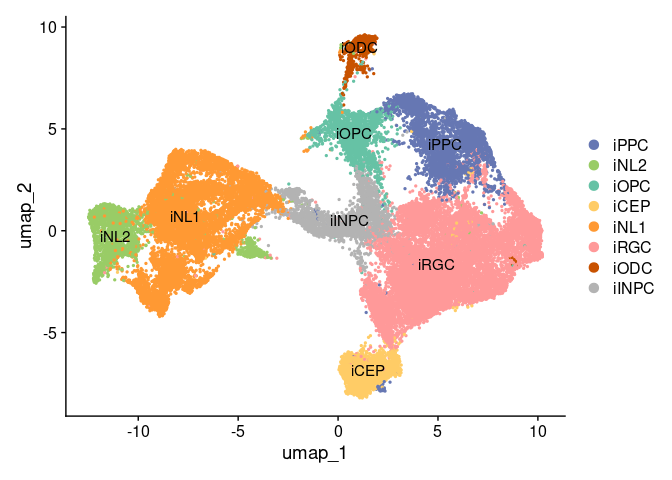

RNAseq_analysis_manuscript
================
2024-05-14

## Load libraries

``` r
.libPaths( c( "/data/Common_Folder/R/Single_cell_packages/", .libPaths()) )

library(Seurat)
library(ggplot2)
library(dplyr)
library(data.table)
library(speckle)
library(openxlsx)
library(data.table)
library(dplyr)
library(openxlsx)

# Uncomment the line below to install the 'presto' package if needed 
#devtools::install_github('immunogenomics/presto')
```

## Load the RNA-Seq data

``` r
# Load the processed Seurat object from the specified path
pd = readRDS("/data/dehestani/scRNAseq_iOligo/Processed_object/ODC35_Seurat_SCT_harmony_annotated_v1.rds")
pd
```

    ## An object of class Seurat 
    ## 63649 features across 35184 samples within 2 assays 
    ## Active assay: RNA (32969 features, 1891 variable features)
    ##  3 layers present: scale.data, data, counts
    ##  1 other assay present: SCT
    ##  3 dimensional reductions calculated: pca, harmony, umap

## Adding cluster cell type names

``` r
# Assign cell type names to clusters
Idents(pd) <- "sub.cluster"
new.cluster.ids <- c("iPPC","iNL2", "iOPC", "iCEP", "iNL1", "iRGC", "iODC", "iINPC")
names(new.cluster.ids) <- levels(pd)
pd <- RenameIdents(pd, new.cluster.ids)
pd@meta.data$BroadCellType <- as.character(Idents(pd))

# Display the count of cells in each cell type
table(pd$BroadCellType)
```

    ## 
    ##  iCEP iINPC  iNL1  iNL2  iODC  iOPC  iPPC  iRGC 
    ##  2214  2550  9272  2355   627  2109  3493 12564

# Calculate cell composition

``` r
# Extract metadata and convert to data.table
md <- pd@meta.data %>% as.data.table()

# Calculate cell numbers and percentages for each cluster
cell_counts_f <- md[, .N, by = c("BroadCellType")]
total_cells <- sum(cell_counts_f$N)
cell_counts_f$Percentage <- (cell_counts_f$N / total_cells) * 100

# Calculate cell numbers and percentages for each cluster and mutation
cell_counts_fm <- md[, .N, by = c("BroadCellType", "Mutation")]
total_cells <- sum(cell_counts_fm$N)
cell_counts_fm$Percentage <- (cell_counts_fm$N / total_cells) * 100

# Pivot table to get LRRK2 and HC percentages
cell_counts_pivot <- dcast(cell_counts_fm, BroadCellType ~ Mutation, value.var = "N")
cell_counts_pivot[, `:=`(LRRK2_Percentage = (LRRK2 / total_cells) * 100, HC_Percentage = (HC / total_cells) * 100)]

# Combine the data into the final table
final_table <- merge(cell_counts_f, cell_counts_pivot, by = "BroadCellType")
final_table <- final_table[, .(BroadCellType, N, Percentage, LRRK2, LRRK2_Percentage, HC, HC_Percentage)]

# Rename columns to match the desired structure
colnames(final_table) <- c("BroadCellType", "N", "Percentage", "LRRK2", "Percentage", "HC", "Percentage")

final_table
```

    ## Key: <BroadCellType>
    ##    BroadCellType     N Percentage LRRK2 Percentage    HC Percentage
    ##           <char> <int>      <num> <int>      <num> <int>      <num>
    ## 1:          iCEP  2214   6.292633  1562   4.439518   652  1.8531151
    ## 2:         iINPC  2550   7.247613  1242   3.530014  1308  3.7175989
    ## 3:          iNL1  9272  26.352888  4607  13.094020  4665 13.2588677
    ## 4:          iNL2  2355   6.693383  1123   3.191792  1232  3.5015916
    ## 5:          iODC   627   1.782060   367   1.043088   260  0.7389723
    ## 6:          iOPC  2109   5.994202  1306   3.711915   803  2.2822874
    ## 7:          iPPC  3493   9.927808  1961   5.573556  1532  4.3542519
    ## 8:          iRGC 12564  35.709413  5957  16.930991  6607 18.7784220

``` r
# Create a new workbook and add a worksheet
#wb <- createWorkbook()
#addWorksheet(wb, "Sheet1")

# Write the data to the worksheet
#writeData(wb, "Sheet1", final_table, startRow = 3, startCol = 2)

# Add bold titles with the same font size and style
#header_style <- createStyle(fontSize = 12, fontName = "Calibri", textDecoration = "bold")
#addStyle(wb, "Sheet1", header_style, rows = 3, cols = 2:8, gridExpand = TRUE)

# Define the path to save the output table and save the workbook
#pathto.outTable <- "/data/nasser/Manuscript/table/Supplementary Tables/"
#saveWorkbook(wb,  file = paste0(pathto.outTable,"Sup2_incls8.xlsx"), overwrite = TRUE)
```

## Figure 1-C: UMAP visualisation

``` r
# Set cell type identities
Idents(pd) <- "BroadCellType"

# Define output path for plots
#pathto.outPlots <- "/data/nasser/Manuscript/plots/figure1/"
#outName <- "Figure1_b_"

# Define color palette for UMAP plot
rushmore_palette <- c("#6677B3", "#99CC66", "#66C2A5", "#FFCC66", "#FF9933", "#FF9999", "#C85200", "#B3B3B3", "#999999", "#666666")

# Create and save UMAP plot
#pathto.outPlots = "/data/nasser/Manuscript/plots/figure1/"
#png(paste0(pathto.outPlots,outName,"UMAP_incl_sample8.png"), width=1500, height=1000,res = 300)
p=DimPlot(pd, reduction = "umap", label = T, pt.size = 0.5, cols = rushmore_palette) 
#dev.off()

# Display the UMAP plot
p
```

<!-- -->

## Exclude sample 8

``` r
# Define output path for processed object
#pathto.outData = "/data/nasser/Manuscript/processedobject/"

# Exclude sample 8 and create a new subset object
Idents(pd) <- "SampleID"
pd <- subset(pd,idents = c("s1", "s2", "s3", "s4", "s5", "s6", "s7") )

# Save the new subset object
#saveRDS(pd, file = paste0(pathto.outData, "ODC35_woClus8_nasser"))
```

\##Read in object without cluster 8

## Figure 1-G :Dotplot with known marker genes for cluster identification

``` r
# Define output path for plots
#pathto.outPlots <- "/data/nasser/Manuscript/plots/figure1/"
#outName <- "Figure1_d_"

# Set the default assay to RNA
DefaultAssay(pd) <- "RNA"

# Set identities to BroadCellType
Idents(pd) = "BroadCellType"

# Define marker genes for dot plot
Genes_dotPlot <- rev(unique(c( "GFAP", "NES","BTG2","HES6", "RBFOX3", "SLC17A6", "SNAP25","RIT2" ,"TH", "ZCCHC12", "SNCA", "CLDN5", "SHH","TOP2A", "MKI67","LRRK2","PDGFRA","MAG", "MBP", "MOG", "PLP1","CNP" )))

# Set levels for pd.sub
levels(pd) <- c('iRGC','iINPC','iNL1', 'iNL2', 'iCEP','iPPC','iOPC','iODC')

# Dot plot for cell markers
#png(paste0(pathto.outPlots,outName,"Dotplot_cellmarkers_update.png"), width=2500, height=1500, res = 300)
DotPlot(pd, idents = c('iRGC','iINPC','iNL1', 'iNL2', 'iCEP','iPPC ','iOPC','iODC'), assay = "RNA", features = Genes_dotPlot,  dot.min = 0.1, cols=c("blue", "red")) + scale_colour_gradient2(low="steelblue", mid="lightgrey", high="red") + RotatedAxis()
```

    ## Scale for colour is already present.
    ## Adding another scale for colour, which will replace the existing scale.

<!-- -->

``` r
#dev.off()
```

## Figure 1-F: Celltype composition calculation

``` r
# Extract metadata and convert to data.table

md <- pd@meta.data %>% as.data.table()

# Calculate cell numbers and percentages for each cluster

cell_counts <- md[, .N, by = c("BroadCellType")]

total_cells <- sum(cell_counts$N)

cell_counts$Percentage <- (cell_counts$N / total_cells) * 100

# Calculate cell counts across samples split by mutation

h <- subset(pd, subset = LRRK2 > 0)

md <- pd@meta.data %>% as.data.table()

md[, .N, by = c("BroadCellType")]
```

    ##    BroadCellType     N
    ##           <char> <int>
    ## 1:          iPPC  2916
    ## 2:          iNL2  2199
    ## 3:          iOPC  2065
    ## 4:          iCEP  1984
    ## 5:          iNL1  6928
    ## 6:          iRGC 10832
    ## 7:          iODC   614
    ## 8:         iINPC  2021

``` r
d <- md[, .N, by = c("SampleID", "BroadCellType")] %>% dcast(., SampleID ~ BroadCellType, value.var = "N")

# Summarize cell counts and calculate percentages for each cell type

d_sum <- d %>%

  rowwise() %>%

  mutate(sum = sum(iCEP, iOPC, iODC, iPPC , iRGC, iINPC, iNL1, iNL2, na.rm = T))

d_sum$iCEP <- (d_sum$iCEP / d_sum$sum * 100)

d_sum$iOPC <- (d_sum$iOPC / d_sum$sum * 100)

d_sum$iODC <- (d_sum$iODC / d_sum$sum * 100)

d_sum$iPPC <- (d_sum$iPPC / d_sum$sum * 100)

d_sum$iRGC <- (d_sum$iRGC / d_sum$sum * 100)

d_sum$iINPC <- (d_sum$iINPC / d_sum$sum * 100)

d_sum$iNL1 <- (d_sum$iNL1 / d_sum$sum * 100)

d_sum$iNL2 <- (d_sum$iNL2 / d_sum$sum * 100)

# Add mutation label according to the subjects order in the metadata

d_sum$Mutation <- c("LRRK2", "LRRK2", "LRRK2", "HC", "HC", "HC", "HC")

d_sum
```

    ## # A tibble: 7 × 11
    ## # Rowwise: 
    ##   SampleID  iCEP iINPC  iNL1  iNL2  iODC  iOPC  iPPC  iRGC   sum Mutation
    ##   <chr>    <dbl> <dbl> <dbl> <dbl> <dbl> <dbl> <dbl> <dbl> <int> <chr>   
    ## 1 s1       15.1   4.29 23.0   9.50 4.29   8.00 12.0   23.8  5198 LRRK2   
    ## 2 s2        4.87  8.50  7.39  1.27 1.04  11.5   9.67  55.8  3857 LRRK2   
    ## 3 s3       10.4   4.70 22.8  12.3  2.64  11.7  11.3   24.2  3445 LRRK2   
    ## 4 s4        2.16  5.52 35.6  10.5  2.50   7.64  7.55  28.5  5602 HC      
    ## 5 s5        3.20  9.58 35.0   4.34 1.09   1.78  8.32  36.7  6337 HC      
    ## 6 s6        3.69  7.44 16.7  11.5  0.977  7.55 16.4   35.7  1842 HC      
    ## 7 s7        7.93  7.78  4.45  4.70 1.01   3.75  8.51  61.9  3278 HC
