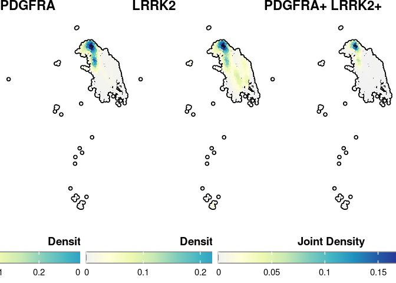
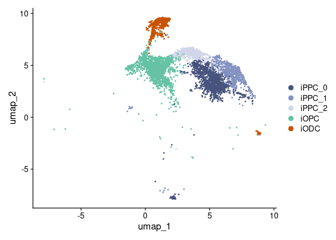
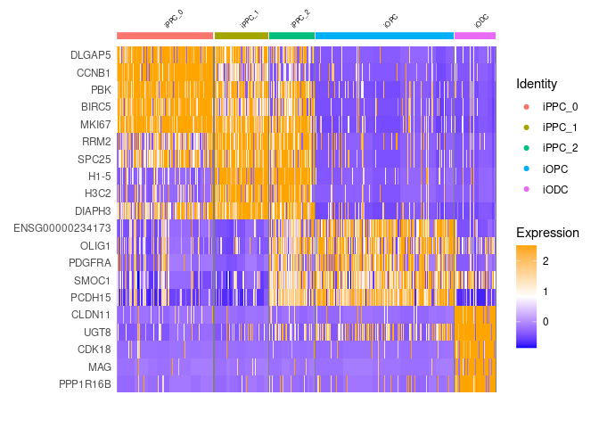

Figure2
================
2024-07-03

## Load libraries

``` r
.libPaths( c( "/data/Common_Folder/R/Single_cell_packages/", .libPaths()) )
library("SCpubr")
library(Seurat)
library(patchwork)
library(gridExtra)
library(ggplot2)
library(future)
library(dplyr)
library(SeuratData)
library(glmGamPoi, lib.loc = "/data/nasser/R/packages_nasser/")
library(harmony)
library(enrichR)
library(gprofiler2)
library(data.table) 
library(speckle, lib.loc = "/data/Common_Folder/R/Single_cell_packages/")
library(ggpubr)
library(data.table)
library(dplyr)
library(openxlsx)
```

## Load the RNA-Seq data

``` r
pd = readRDS("/data/nasser/Manuscript/Strict_threshold/processedobject/ODC35_woClus8_subclust3_res0.15_NK")
pd
```

    ## An object of class Seurat 
    ## 63649 features across 29559 samples within 2 assays 
    ## Active assay: RNA (32969 features, 1891 variable features)
    ##  3 layers present: scale.data, data, counts
    ##  1 other assay present: SCT
    ##  3 dimensional reductions calculated: pca, harmony, umap

\##Find subcluster of iPPC cluster with res0.15

``` r
#Find sub-cluster of iPPC with res = 0.15. 
Idents(pd) <- "sub.cluster"
pd.sub <- FindSubCluster(object = pd, resolution = 0.15, cluster= "3", graph.name = "SCT_nn", subcluster.name = "sub.cluster.iPPC") 
```

    ## Modularity Optimizer version 1.3.0 by Ludo Waltman and Nees Jan van Eck
    ## 
    ## Number of nodes: 2916
    ## Number of edges: 21253
    ## 
    ## Running Louvain algorithm...
    ## Maximum modularity in 10 random starts: 0.8964
    ## Number of communities: 6
    ## Elapsed time: 0 seconds

    ## 3 singletons identified. 3 final clusters.

## Adding cluster cell type names

``` r
### Naming clusters ###
Idents(pd.sub) <- "sub.cluster.iPPC"
new.cluster.ids <- c("iPPC_1","iNL2", "iOPC", "iCEP", "iNL1", "iRGC", "iPPC_0" , "iODC", "iINPC", "iPPC_2")
names(new.cluster.ids) <- levels(pd.sub)
pd.sub <- RenameIdents(pd.sub, new.cluster.ids)
pd.sub@meta.data$CellType <- as.character(Idents(pd.sub))

Idents(pd.sub) <- "CellType"
table(Idents(pd.sub))
```

    ## 
    ## iPPC_1   iNL2   iOPC   iCEP   iNL1   iRGC iPPC_0   iODC  iINPC iPPC_2 
    ##    805   2199   2065   1984   6928  10832   1440    614   2021    671

``` r
#save object
#pathto.outData = "/data/nasser/Manuscript/processedobject/"
#saveRDS(pd.sub,file=paste0(pathto.outData,"ODC35_woClus8_subclust3_res0.15_NK"))
```

## Figure 2-A: Feature plot

``` r
p <- SCpubr::do_NebulosaPlot(ippc_sub,
                        features = c("PDGFRA","LRRK2"), joint=T)
#pathto.outPlots = "/data/nasser/Manuscript/plots/figure2/"
#outname = "figure2_d_"
#png(paste0(pathto.outPlots,outname,"SCpubR_JointDensity_PDGFRA_LRRK2.png"), width=5000, height=3000, res = 300)
p
```

<!-- -->

``` r
#dev.off()
```

## Figure 2-B : UMAP visualisation of clusters

``` r
Idents(pd.sub) <- "CellType"

rushmore_palette <- c("#47537d","#8492c2", "#d1d6e8", "#99CC66", "#66C2A5", "#FFCC66", "#FF9933", "#FF9999", "#C85200", "#B3B3B3")
levels(pd.sub) <- c('iPPC_0','iPPC_1','iPPC_2',"iNL2", "iOPC", "iCEP", "iNL1", "iRGC", "iODC", "iINPC")

#pathto.outPlots = "/data/nasser/Manuscript/plots/figure2/"
#outname = "figure2_a_"

#png(paste0(pathto.outPlots,outname,"UMAP_subcluster3.png"), width=1500, height=1000,res = 300)
p=DimPlot(object = pd.sub, reduction = "umap", label = F, pt.size = 0.5, cols = rushmore_palette) 
#dev.off()

p
```

<!-- -->

<!-- ## Supplementary table S2 - excluding sample 8 + iPPC cell types -->
<!-- ```{r} -->
<!-- # Extract metadata -->
<!-- md <- pd.sub@meta.data %>% as.data.table() -->
<!-- # Calculate cell numbers and percentages for each cluster -->
<!-- cell_counts_f <- md[, .N, by = c("CellType")] -->
<!-- total_cells <- sum(cell_counts_f$N) -->
<!-- cell_counts_f$Percentage <- (cell_counts_f$N / total_cells) * 100 -->
<!-- # Calculate cell numbers and percentages for each cluster and mutation -->
<!-- cell_counts_fm <- md[, .N, by = c("CellType", "Mutation")] -->
<!-- total_cells <- sum(cell_counts_fm$N) -->
<!-- cell_counts_fm$Percentage <- (cell_counts_fm$N / total_cells) * 100 -->
<!-- # Pivot table to get LRRK2 and HC percentages -->
<!-- cell_counts_pivot <- dcast(cell_counts_fm, CellType ~ Mutation, value.var = "N") -->
<!-- cell_counts_pivot[, `:=`(LRRK2_Percentage = (LRRK2 / total_cells) * 100, HC_Percentage = (HC / total_cells) * 100)] -->
<!-- # Combine the data into the final table -->
<!-- final_table <- merge(cell_counts_f, cell_counts_pivot, by = "CellType") -->
<!-- final_table <- final_table[, .(CellType, N, Percentage, LRRK2, LRRK2_Percentage, HC, HC_Percentage)] -->
<!-- # Rename columns to match the desired structure -->
<!-- colnames(final_table) <- c("Celltype", "N", "Percentage", "LRRK2", "Percentage", "HC", "Percentage") -->
<!-- # Create a new workbook and add a worksheet -->
<!-- wb <- createWorkbook() -->
<!-- addWorksheet(wb, "Sheet1") -->
<!-- # Write the data to the worksheet -->
<!-- writeData(wb, "Sheet1", final_table, startRow = 3, startCol = 2) -->
<!-- # Add bold titles with the same font size and style -->
<!-- header_style <- createStyle(fontSize = 12, fontName = "Calibri", textDecoration = "bold") -->
<!-- addStyle(wb, "Sheet1", header_style, rows = 3, cols = 2:8, gridExpand = TRUE) -->
<!-- pathto.outTable <- "/data/nasser/Manuscript/table/Supplementary Tables/" -->
<!-- saveWorkbook(wb,  file = paste0(pathto.outTable,"Sup2_excl8_ippc.xlsx"), overwrite = TRUE) -->
<!-- ``` -->

### Figure 2-B : UMAP for oligodendrolineage subcluster

``` r
olig_sub = subset(pd.sub, idents = c("iPPC_0", "iPPC_1", "iPPC_2", "iODC", "iOPC"))
levels(olig_sub) <- c('iPPC_0','iPPC_1','iPPC_2', "iOPC", "iODC")


#pathto.outPlots = "/data/nasser/Manuscript/plots/figure2/"
#outname = "figure2_a_"
rushmore_palette <- c("#47537d","#8492c2", "#d1d6e8","#66C2A5", "#C85200")

#png(paste0(pathto.outPlots,outname,"UMAP_olig_lineage.png"), width=1500, height=1000,res = 300)
DimPlot(object = olig_sub, reduction = "umap", label = F, pt.size = 0.5, cols = rushmore_palette) 
```

<!-- -->

``` r
#dev.off()
```

\#Find all markers for all clusters to identify genes that are markers
for specific clusters

``` r
test.markers_default <- FindAllMarkers(pd.sub, only.pos= TRUE)
```

    ## Calculating cluster iPPC_0

    ## Calculating cluster iPPC_1

    ## Calculating cluster iPPC_2

    ## Calculating cluster iNL2

    ## Calculating cluster iOPC

    ## Calculating cluster iCEP

    ## Calculating cluster iNL1

    ## Calculating cluster iRGC

    ## Calculating cluster iODC

    ## Calculating cluster iINPC

``` r
test.markers_default <- test.markers_default[test.markers_default$p_val_adj < 0.05, ]

head(test.markers_default)
```

    ##        p_val avg_log2FC pct.1 pct.2 p_val_adj cluster   gene
    ## DLGAP5     0   4.644809 0.924 0.094         0  iPPC_0 DLGAP5
    ## CCNB1      0   4.954365 0.963 0.144         0  iPPC_0  CCNB1
    ## PBK        0   3.909149 0.960 0.150         0  iPPC_0    PBK
    ## BIRC5      0   3.946694 0.962 0.155         0  iPPC_0  BIRC5
    ## MKI67      0   4.071004 0.972 0.172         0  iPPC_0  MKI67
    ## ASPM       0   4.640482 0.921 0.125         0  iPPC_0   ASPM

``` r
#pathto.outTable= "/data/nasser/Manuscript/table/Figure2/"
#pathto.outsupTable= "/data/nasser/Manuscript/table/Supplementary Tables/"

#outname = "all_clusters_"
#write.table(test.markers_default, file=paste0(pathto.outTable,outname,"findallmarkers_default.csv"), sep=",", quote = F)

#write.table(test.markers_all, file=paste0(pathto.outTable,outname,"findallmarkers_minpct02.csv"), sep=",", quote = F)
#write.table(test.markers_all, file=paste0(pathto.outsupTable,outname,"findallmarkers_minpct02.csv"), sep=",", quote = F)
```

## Figure 2-C: Heatmap of markers for oligodendroglial clusters

``` r
# Filter for specific clusters
clusters_of_interest <- c('iPPC_0','iPPC_1','iPPC_2', 'iOPC', 'iODC')

top_markers <- test.markers_default %>%
    dplyr::filter(cluster %in% clusters_of_interest) %>%
    group_by(cluster) %>%
    dplyr::filter(avg_log2FC > 1) %>%
    slice_head(n = 5) %>%
    ungroup()

# Set factor levels for the clusters of interest
top_markers$cluster <- factor(top_markers$cluster, levels = clusters_of_interest)

# Arrange by cluster for plotting
top_markers <- top_markers %>%
    arrange(cluster)

# Display the top markers for verification
top_markers
```

    ## # A tibble: 25 × 7
    ##    p_val avg_log2FC pct.1 pct.2 p_val_adj cluster gene  
    ##    <dbl>      <dbl> <dbl> <dbl>     <dbl> <fct>   <chr> 
    ##  1     0       4.64 0.924 0.094         0 iPPC_0  DLGAP5
    ##  2     0       4.95 0.963 0.144         0 iPPC_0  CCNB1 
    ##  3     0       3.91 0.96  0.15          0 iPPC_0  PBK   
    ##  4     0       3.95 0.962 0.155         0 iPPC_0  BIRC5 
    ##  5     0       4.07 0.972 0.172         0 iPPC_0  MKI67 
    ##  6     0       3.44 0.944 0.121         0 iPPC_1  RRM2  
    ##  7     0       3.44 0.943 0.124         0 iPPC_1  SPC25 
    ##  8     0       4.01 0.909 0.105         0 iPPC_1  H1-5  
    ##  9     0       3.90 0.897 0.095         0 iPPC_1  H3C2  
    ## 10     0       3.30 0.981 0.185         0 iPPC_1  DIAPH3
    ## # ℹ 15 more rows

``` r
# Ensure the Seurat object is set to the correct identity class
Idents(pd.sub) <- "CellType"

# Plot the heatmap for the selected features (genes)
DoHeatmap(olig_sub, features = top_markers$gene, size = 2) + 
    scale_fill_gradientn(colors = c("blue", "white", "orange"))
```

    ## Scale for fill is already present.
    ## Adding another scale for fill, which will replace the existing scale.

<!-- -->

``` r
test.markers_olig <- FindAllMarkers(ippc_sub, only.pos= TRUE, min.pct =0.1, logfc.threshold=0.1, min.diff.pct = 0.2)
```

    ## Calculating cluster iPPC_1

    ## Calculating cluster iPPC_0

    ## Calculating cluster iPPC_2

``` r
test.markers_olig <- test.markers_olig[test.markers_olig$p_val_adj < 0.05, ]


#pathto.outTable = "/data/nasser/Manuscript/table/Figure2/"
#pathto.outsupTable= "/data/nasser/Manuscript/table/Supplementary Tables/"
#outname = "ippc_clusters_"
#write.table(test.markers_olig, file=paste0(pathto.outTable,outname, "findallmarkers_minpco0.1_log0.1_diffpct0.2.csv"), sep=",", quote = F)
#write.table(test.markers_olig, file=paste0(pathto.outsupTable,outname, "findallmarkers_minpco0.1_log0.1_diffpct0.2.csv"), sep=",", quote = F)
```

<!-- ```{r} -->
<!-- # top markers for ippc cluster -->
<!-- top_markers_ippc <- test.markers_olig %>% -->
<!--     group_by(cluster) %>% -->
<!--     dplyr::filter(avg_log2FC > 1) %>% -->
<!--     slice_head(n = 8) %>% -->
<!--     ungroup() -> top10 -->
<!-- levels_order <- c('iPPC_0','iPPC_1','iPPC_2') -->
<!-- top_markers_ippc$cluster <- factor(top_markers_ippc$cluster, levels = levels_order) -->
<!-- top10 <- top_markers_ippc %>% -->
<!--     arrange(cluster) -->
<!-- ippc_sub@active.ident <- factor(x = ippc_sub@active.ident, levels = levels_order) -->
<!-- #do_ExpressionHeatmap(ippc_sub, features = top10$gene, cluster= T, font.size    = 8, flip=F,viridis.direction=-1, ) -->
<!-- #pathto.outPlots = "/data/nasser/Manuscript/plots/figure2/" -->
<!-- #outname = "figure2_c_" -->
<!-- #png(paste0(pathto.outPlots,outname,"heatmap_subcluster3_new.png"), width=2000, height=2000,res = 300) -->
<!-- DoHeatmap(ippc_sub, features = top10$gene, size = 4, disp.max = 2)+ scale_fill_gradientn(colors = c("blue", "white", "orange")) -->
<!-- #dev.off() -->
<!-- p -->
<!-- ``` -->

## Speckle analysis on cell type mutation composition

Calculate fischer exact test on cell type mutation composition.
difference in the distribution of cell counts across different cell
types (clusters) between the “HC” (Healthy Control) and “LRRK2” group

``` r
#pathto.outTable <- "/data/nasser/Manuscript/table/Supplementary Tables/"

Idents(pd.sub) <- "CellType"
p=propeller(clusters=pd.sub$CellType, sample=pd.sub$SampleID, group=pd.sub$Mutation)
```

    ## Performing logit transformation of proportions

    ## group variable has 2 levels, t-tests will be performed

``` r
p
```

    ##        BaselineProp.clusters BaselineProp.Freq PropMean.HC PropMean.LRRK2
    ## iPPC_2                iPPC_2        0.02270036  0.01511071     0.03585171
    ## iCEP                    iCEP        0.06712000  0.04246664     0.10125846
    ## iOPC                    iOPC        0.06986028  0.05180435     0.10395601
    ## iODC                    iODC        0.02077202  0.01392965     0.02656232
    ## iINPC                  iINPC        0.06837173  0.07577813     0.05832199
    ## iRGC                    iRGC        0.36645353  0.40681374     0.34614283
    ## iNL2                    iNL2        0.07439359  0.07774153     0.07693922
    ## iPPC_1                iPPC_1        0.02723367  0.03155259     0.02624439
    ## iNL1                    iNL1        0.23437870  0.22939618     0.17705719
    ## iPPC_0                iPPC_0        0.04871613  0.05540648     0.04766589
    ##        PropRatio Tstatistic    P.Value       FDR
    ## iPPC_2 0.4214781 -2.3063143 0.03114099 0.2236742
    ## iCEP   0.4193886 -2.0336986 0.05451654 0.2236742
    ## iOPC   0.4983296 -1.9285727 0.06710226 0.2236742
    ## iODC   0.5244140 -1.2562924 0.22250006 0.5562502
    ## iINPC  1.2993063  0.7248863 0.47634359 0.7927261
    ## iRGC   1.1752771  0.6135148 0.54597770 0.7927261
    ## iNL2   1.0104279  0.5231963 0.60698214 0.7927261
    ## iPPC_1 1.2022606  0.3365231 0.73974151 0.7927261
    ## iNL1   1.2956050  0.3212357 0.75159428 0.7927261
    ## iPPC_0 1.1623925  0.2660649 0.79272607 0.7927261

``` r
#write.table(p, file = paste0(pathto.outTable,"S2_speckle_ippc_new.csv"), quote = F, sep = ",", row.names = T)
```

\##Figure 2-F: Celltype composition boxplot

``` r
ggplot(pd@meta.data, aes(x=CellType, fill=Mutation)) + 
  geom_bar(position = "fill") + geom_text(stat = 'count', aes(label = ..count..), position = position_fill(vjust = 0.5)) + RotatedAxis() + theme_classic()
```

    ## Warning: The dot-dot notation (`..count..`) was deprecated in ggplot2 3.4.0.
    ## ℹ Please use `after_stat(count)` instead.
    ## This warning is displayed once every 8 hours.
    ## Call `lifecycle::last_lifecycle_warnings()` to see where this warning was
    ## generated.

<!-- -->

## Cell cycle scoring

``` r
levels(pd.sub) <- c('iPPC_0','iPPC_1','iPPC_2',"iNL2", "iOPC", "iCEP", "iNL1", "iRGC", "iODC", "iINPC")

table(Idents(pd.sub))
```

    ## 
    ## iPPC_0 iPPC_1 iPPC_2   iNL2   iOPC   iCEP   iNL1   iRGC   iODC  iINPC 
    ##   1440    805    671   2199   2065   1984   6928  10832    614   2021

``` r
#Cell cycle scoring 
data.filt <- CellCycleScoring(
  object = pd.sub,
  g2m.features = cc.genes$g2m.genes,
  s.features = cc.genes$s.genes
)
```

    ## Warning: The following features are not present in the object: MLF1IP, not
    ## searching for symbol synonyms

    ## Warning: The following features are not present in the object: FAM64A, HN1, not
    ## searching for symbol synonyms

``` r
VlnPlot(data.filt, features = c("S.Score","G2M.Score")) #higher G2M =  more actively dividing cells and higher S = more actively replicating DNA for following divisions
```

<!-- -->

``` r
#pathto.outPlots = "/data/nasser/Manuscript/plots/figure2/"
#outname = "figure2_b_"
#png(paste0(pathto.outPlots,outname,"S.Score.png"), width=5000, height=3000, res = 300)
VlnPlot(data.filt, features = c("S.Score"), split.by = "Mutation") 
```

    ## The default behaviour of split.by has changed.
    ## Separate violin plots are now plotted side-by-side.
    ## To restore the old behaviour of a single split violin,
    ## set split.plot = TRUE.
    ##       
    ## This message will be shown once per session.

<!-- -->

``` r
#png(paste0(pathto.outPlots,outname,"G2M.Score.png"), width=5000, height=3000, res = 300)
VlnPlot(data.filt, features = c("G2M.Score"), split.by = "Mutation") 
```

<!-- -->

``` r
#dev.off()
```

<!-- #Enriched expression of cell cycle related genes -->
<!-- ```{r} -->
<!-- #Enriched expressio of cell cycle related genes -->
<!-- genes_dotPlot <- rev(unique(c( "PDGFRA", "LRRK2", "TOP2A","MKI67"))) -->
<!-- #levels(oligo_subset) <- c('2_0','2_2','3_0', '3_1', '3_2','3_3','6') -->
<!-- # Filter the dataframe if they are in findmarkers -->
<!-- genes_in_test_markers <- test.markers %>% -->
<!--   filter(gene %in% genes_dotPlot) -->
<!-- genes_in_test_markers -->
<!-- # Extract unique genes from the dataframe -->
<!-- unique_genes <- unique(genes_in_test_markers$gene) -->
<!-- # Check which genes in genes_dotPlot are present in unique_genes -->
<!-- genes_present <- genes_dotPlot %in% unique_genes -->
<!-- # Determine if all genes are present -->
<!-- all_present <- all(genes_present) -->
<!-- # Identify missing genes if any -->
<!-- missing_genes <- genes_dotPlot[!genes_present] -->
<!-- # Output the result -->
<!-- if (all_present) { -->
<!--   print(TRUE) -->
<!-- } else { -->
<!--   print(FALSE) -->
<!--   print(missing_genes) -->
<!-- } -->
<!-- #pathto.outPlots = "/data/nasser/Manuscript/plots/figure2/" -->
<!-- #outname = "figure2_b_" -->
<!-- #png(paste0(pathto.outPlots,outname,"Dotplot_markers.png"), width=5000, height=3000, res = 300) -->
<!-- DotPlot(pd.sub, assay = "RNA", features = (genes_dotPlot), dot.min = 0.3, cols=c( "blue", "red")) + scale_colour_gradient2(low="steelblue", mid="lightgrey", high="red") +RotatedAxis() -->
<!-- #dev.off() -->
<!-- ``` -->
