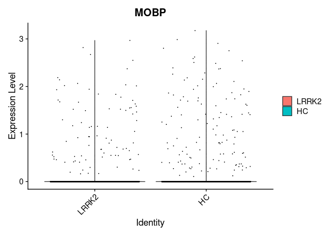
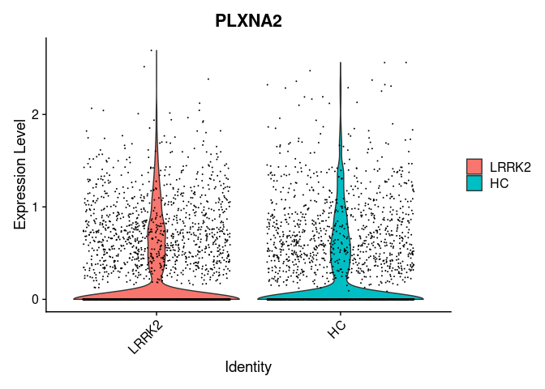
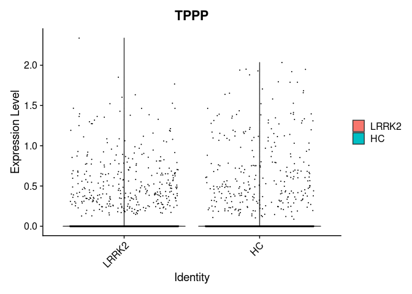
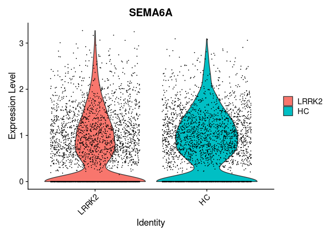
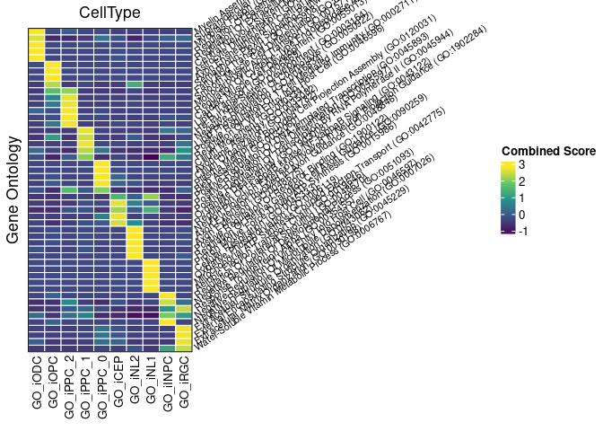

Figure 4
================
2024-07-03

- [Load libraries](#load-libraries)
- [Load the RNA-Seq data](#load-the-rna-seq-data)
- [Figure 4-A: UpSet plot for Downregulated
  genes](#figure-4-a-upset-plot-for-downregulated-genes)
- [Figure 4-B: Violin plots of MOBP, PLXNA2, TPPP and SEMA6A in
  oligodendroglial
  lineage](#figure-4-b-violin-plots-of-mobp-plxna2-tppp-and-sema6a-in-oligodendroglial-lineage)
- [Figure 4-C: GO terms of downregulated
  DEGs](#figure-4-c-go-terms-of-downregulated-degs)
- [Figure 4-C: GO Heatmap for downregulated
  DEGs](#figure-4-c-go-heatmap-for-downregulated-degs)

------------------------------------------------------------------------

## Load libraries

``` r
.libPaths( c( "/data/Common_Folder/R/Single_cell_packages/", .libPaths()) )
library("SCpubr")
library(Seurat)
library(patchwork)
library(gridExtra)
library(ggplot2)
library(future)
library(dplyr)
library(SeuratData)
library(glmGamPoi, lib.loc = "/data/nasser/R/packages_nasser/")
library(harmony)
library(enrichR)
library(gprofiler2)
library(data.table) 
library(speckle, lib.loc = "/data/Common_Folder/R/Single_cell_packages/")
library(ggpubr)
library(tibble)

library(tidyverse)
library(ComplexHeatmap)
library(circlize)
library(viridis)
library(UpSetR)

#devtools::install_github('immunogenomics/presto')
```

## Load the RNA-Seq data

``` r
pd = readRDS("/data/nasser/Manuscript/Strict_threshold/processedobject/ODC35_woClus8_subclust3_res0.15_NK")
```

## Figure 4-A: UpSet plot for Downregulated genes

``` r
#Upset plots data prep

# Define clusters and path to DEG files
clusters <- c("iPPC_0", "iPPC_1", "iPPC_2", "iNL2", "iOPC", "iCEP", "iNL1", "iRGC", "iODC", "iINPC")
pathto.inTable <- "/data/nasser/Manuscript/Strict_threshold/table/Figure3/DEGs_down/"

# Initialize an empty list to store DEGs for each cluster
deg_lists <- list()

# Loop through each cluster to read the DEG files
for (cluster in clusters) {
    file_path <- paste0(pathto.inTable, cluster, "_down.csv")
    if (file.exists(file_path)) {
        deg_df <- read.csv(file_path, header = FALSE)
        # Extract the gene names from the first column
        gene_names <- deg_df[, 1]
        deg_lists[[cluster]] <- gene_names
    }
}
 

# Create a combination matrix using ComplexHeatmap's make_comb_mat function
comb_mat <- make_comb_mat(deg_lists)

comb_mat <- comb_mat[comb_size(comb_mat) >= 5]
desired_celltype_order <- c('iODC', 'iOPC', 'iPPC_2', 'iPPC_1', 'iPPC_0', 'iCEP', 'iNL2', 'iNL1', 'iINPC', 'iRGC')

#pathto.outPlots = "/data/nasser/Manuscript/plots/figure3/"
#png(paste0(pathto.outPlots,"UpSet_down_new.png"), width=2500, height=1500, res = 300)
ht <- UpSet(comb_mat, top_annotation = upset_top_annotation(comb_mat, add_numbers = TRUE),
    left_annotation = upset_left_annotation(comb_mat, add_numbers = TRUE),
            set_order = desired_celltype_order,
            comb_order = order(comb_size(comb_mat), decreasing = TRUE))
ht  
```

<!-- -->

``` r
#dev.off()
```

## Figure 4-B: Violin plots of MOBP, PLXNA2, TPPP and SEMA6A in oligodendroglial lineage

``` r
Idents(pd) = "CellType"
#pathto.outPlots= "/data/nasser/Manuscript/plots/figure3/"
celltype_subset <- subset(pd, idents = c("iOPC","iPPC_2", "iPPC_0", "iPPC_1", "iODC"))
Idents(celltype_subset) <- "Mutation"
#png(paste0(pathto.outPlots,"vlnplot_iOPC_LRRK2_PDGFRA_up_regulated.png"), width=2000, height=1100, res = 300)
VlnPlot(celltype_subset, features = "MOBP")
```

<!-- -->

``` r
#dev.off()

Idents(pd) = "CellType"
#pathto.outPlots= "/data/nasser/Manuscript/plots/figure3/"
celltype_subset <- subset(pd, idents = c("iOPC","iPPC_2", "iPPC_0", "iPPC_1", "iODC"))
Idents(celltype_subset) <- "Mutation"
#png(paste0(pathto.outPlots,"vlnplot_iOPC_LRRK2_PDGFRA_up_regulated.png"), width=2000, height=1100, res = 300)
VlnPlot(celltype_subset, features = "PLXNA2")
```

<!-- -->

``` r
#dev.off()

Idents(pd) = "CellType"
#pathto.outPlots= "/data/nasser/Manuscript/plots/figure3/"
celltype_subset <- subset(pd, idents = c("iOPC","iPPC_2", "iPPC_0", "iPPC_1", "iODC"))
Idents(celltype_subset) <- "Mutation"
#png(paste0(pathto.outPlots,"vlnplot_iOPC_LRRK2_PDGFRA_up_regulated.png"), width=2000, height=1100, res = 300)
VlnPlot(celltype_subset, features = "TPPP")
```

<!-- -->

``` r
#dev.off()

Idents(pd) = "CellType"
#pathto.outPlots= "/data/nasser/Manuscript/plots/figure3/"
celltype_subset <- subset(pd, idents = c("iOPC","iPPC_2", "iPPC_0", "iPPC_1", "iODC"))
Idents(celltype_subset) <- "Mutation"
#png(paste0(pathto.outPlots,"vlnplot_iOPC_LRRK2_PDGFRA_up_regulated.png"), width=2000, height=1100, res = 300)
VlnPlot(celltype_subset, features = "SEMA6A")
```

<!-- -->

``` r
#dev.off()
```

## Figure 4-C: GO terms of downregulated DEGs

``` r
# Define the path to the directory containing the files
path <- "/data/nasser/Manuscript/Strict_threshold/table/Figure3/GOs/GO_ODC35/"

# List all files in the directory that match the pattern for downregulated genes
files_up <- list.files(path, pattern = "down.txt$", full.names = TRUE)

# Initialize an empty list to store data frames
go_data_list <- list()
top_terms_list <- list()

# Read each file and store in the list
for (file in files_up) {
  cell_type <- gsub(".*\\/|_down.txt", "", file) # Extract cell type from file name
  go_data <- read.delim(file, header = TRUE, sep = "\t") # Adjust if necessary
  
  # Add a column for cell type
  go_data$CellType <- cell_type
  
  # Append the full data to the list
  go_data_list[[cell_type]] <- go_data
  
  # Select top 5 terms by combined score
  top_go_data <- go_data %>%
    arrange(P.value) %>%
    slice_head(n = 5)
  
  # Append to the top terms list
  top_terms_list[[cell_type]] <- top_go_data
}

# Combine all top terms data frames into one
top_go_data_combined <- bind_rows(top_terms_list)

# Define the desired cell type order
desired_celltype_order <- c('GO_iODC', 'GO_iOPC', 'GO_iPPC_2', 'GO_iPPC_1', 'GO_iPPC_0', 'GO_iCEP', 'GO_iNL2', 'GO_iNL1', 'GO_iINPC', 'GO_iRGC')


# Arrange the dataframe with the specified order of CellType column
top_go_data_combined <- top_go_data_combined %>%
  mutate(CellType = factor(CellType, levels = desired_celltype_order)) %>%
  arrange(CellType)

# Combine all full data frames into one
full_go_data_combined <- bind_rows(go_data_list)

# Create a data frame ensuring all top terms are represented across cell types
heatmap_data <- expand.grid(Term = unique(top_go_data_combined$Term), CellType = unique(full_go_data_combined$CellType)) %>%
  left_join(full_go_data_combined %>% select(Term, Combined.Score, CellType), by = c("Term", "CellType")) %>%
  spread(key = CellType, value = Combined.Score)

# Ensure the order of Terms is preserved
heatmap_data <- heatmap_data %>%
  mutate(Term = factor(Term, levels = unique(top_go_data_combined$Term))) %>%
  arrange(Term)

# Re-order columns in heatmap_data
heatmap_data <- heatmap_data %>%
  select(Term, all_of(desired_celltype_order))

# Convert to a matrix for the heatmap
heatmap_matrix <- as.matrix(heatmap_data %>% select(-Term))
rownames(heatmap_matrix) <- heatmap_data$Term

# Replace NA values with a sensible default, such as a value slightly above the threshold for significance
heatmap_matrix[is.na(heatmap_matrix)] <- 0
```

## Figure 4-C: GO Heatmap for downregulated DEGs

``` r
# Cap the maximum value to a specified threshold
scaled_mat = t(scale(t(heatmap_matrix)))
#scaled_mat[is.na(scaled_mat)] <- 0


#pathto.outPlots = "/data/nasser/Manuscript/plots/figure3/"
#png(paste0(pathto.outPlots,"GO_down_heatmap_scaled_top5_pvalue_all.png"), width=6000, height=4000, res = 300)
# Generate the heatmap with capped values
Heatmap(scaled_mat,
        row_names_max_width = max_text_width(rownames(scaled_mat)),cluster_columns = FALSE, cluster_rows = FALSE,
        border_gp = gpar(col = "black"),
        rect_gp = gpar(col = "white") ,
        name = "Capped Combined Score",
        row_names_gp = gpar(fontsize = 8),
        column_names_gp = gpar(fontsize = 10),
        heatmap_legend_param = list(title = "Combined Score"),
        column_title = "CellType", 
        row_title = "Gene Ontology",
        col = viridis(5),
        row_names_rot = 35
)
```

<!-- -->

``` r
#dev.off()
```
