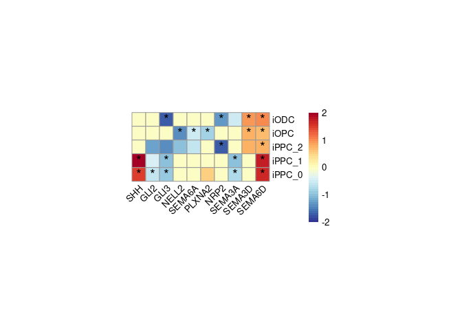

Closing figure heatmap
================
2024-07-03

- [Load necessary libraries](#load-necessary-libraries)
- [Generate Heatmap of Differentially Expressed
  Genes](#generate-heatmap-of-differentially-expressed-genes)

## Load necessary libraries

``` r
library(ggplot2)
library(reshape2)
library(readxl)
library(pheatmap)
library(grid)
```

## Generate Heatmap of Differentially Expressed Genes

``` r
# Define the path to your Excel file
file_path <- "/data/nasser/Manuscript/Strict_threshold/table/Figure3/DEGs/DEGs.xlsx"

# Define the list of genes
genes <- c("SHH", "GLI1", "GLI2", "GLI3", "PTCH1", "PTCH2", "SMO", "SEMA3A", "SEMA3C", "SEMA3D", "SEMA4C", 
           "SEMA4D", "SEMA5A", "SEMA5B", "SEMA6A", "SEMA6B", "SEMA6D", "PLXNA1", "PLXNA2", "PLXNA3", 
           "PLXNA4", "PLXNB1", "PLXNB2", "PLXND1", "NRP1", "NRP2", "NELL1", "NELL2")

# Define the list of clusters to keep
clusters_to_keep <- c("iPPC_0", "iPPC_1", "iPPC_2", "iODC", "iOPC")

# Read data from each sheet and extract relevant information
sheet_names <- excel_sheets(file_path)
results <- data.frame(Gene=character(), Cell=character(), Adjusted_p_value=double(), Log_fold_change=double(), stringsAsFactors=FALSE)

for (sheet in sheet_names) {
  df <- read_excel(file_path, sheet = sheet, skip = 2)
  for (gene in genes) {
    if (gene %in% df$Gene) {
      gene_data <- df[df$Gene == gene, ]
      results <- rbind(results, data.frame(Gene=gene, Cell=sheet, Adjusted_p_value=gene_data$p_val_adj, Log_fold_change=gene_data$avg_log2FC))
    }
  }
}
```

    ## New names:
    ## New names:
    ## New names:
    ## New names:
    ## New names:
    ## New names:
    ## New names:
    ## New names:
    ## New names:
    ## New names:
    ## • `` -> `...8`
    ## • `` -> `...10`

``` r
# Filter results to keep only the specified clusters
results <- results[results$Cell %in% clusters_to_keep, ]

# Ensure that the data is correctly formatted
results$Gene <- as.character(results$Gene)
results$Cell <- as.character(results$Cell)
results$Adjusted_p_value <- as.numeric(results$Adjusted_p_value)
results$Log_fold_change <- as.numeric(results$Log_fold_change)
str(results)
```

    ## 'data.frame':    29 obs. of  4 variables:
    ##  $ Gene            : chr  "SHH" "GLI2" "GLI3" "SEMA3A" ...
    ##  $ Cell            : chr  "iPPC_0" "iPPC_0" "iPPC_0" "iPPC_0" ...
    ##  $ Adjusted_p_value: num  1.11e-04 2.18e-03 3.04e-09 3.32e-20 4.45e-21 ...
    ##  $ Log_fold_change : num  1.514 -0.596 -0.88 -0.744 1.624 ...

``` r
# Create the heatmap matrix
heatmap_matrix <- matrix(NA, nrow = length(unique(results$Cell)), ncol = length(genes))
rownames(heatmap_matrix) <- unique(results$Cell)
colnames(heatmap_matrix) <- genes

# Fill the matrix with log fold change values
for (i in 1:nrow(results)) {
  cell <- results$Cell[i]
  gene <- results$Gene[i]
  logfc <- results$Log_fold_change[i]
  heatmap_matrix[cell, gene] <- logfc
}

# Create the significance matrix
significance_matrix <- matrix("", nrow = length(unique(results$Cell)), ncol = length(genes))
rownames(significance_matrix) <- unique(results$Cell)
colnames(significance_matrix) <- genes

for (i in 1:nrow(results)) {
  cell <- results$Cell[i]
  gene <- results$Gene[i]
  p_adj <- results$Adjusted_p_value[i]
  if (p_adj < 0.05) {
    significance_matrix[cell, gene] <- "*"
  }
}

# Scale data for better visualization
scaled_mat <- heatmap_matrix
scaled_mat[is.na(scaled_mat)] <- 0

# Reorder rows
row_order <- c("iODC", "iOPC", "iPPC_2", "iPPC_1", "iPPC_0")

# Reorder scaled_mat rows
scaled_mat <- scaled_mat[row_order, ]

# Sort columns alphabetically, with SHH and GLI genes at the beginning
sorted_genes <- c("SHH", "GLI2", "GLI3", "NELL2","SEMA6A", "PLXNA2", "NRP2", "SEMA3A", "SEMA3D",  "SEMA6D")
scaled_mat <- scaled_mat[, sorted_genes]
significance_matrix <- significance_matrix[row_order, sorted_genes]

# Generate the heatmap and save as PDF
#pathto.outPlots = "/data/nasser/Manuscript/plots/"
#outname = "Figure6_"
#
#pdf(paste0(pathto.outPlots, outname, "heatmap_star.pdf"))
#png(paste0(pathto.outPlots,outname,"heatmap_star.png"), width=1500, height=2000,res = 300)


col <- colorRampPalette(rev(RColorBrewer::brewer.pal(n = 30, name = "RdYlBu")))(50)
```

    ## Warning in RColorBrewer::brewer.pal(n = 30, name = "RdYlBu"): n too large, allowed maximum for palette RdYlBu is 11
    ## Returning the palette you asked for with that many colors

``` r
pheatmap(scaled_mat, cluster_cols = FALSE, cluster_rows = FALSE, show_row_names=TRUE,
                row_names_side="left", show_colnames = TRUE,
         cellwidth = 15, cellheight = 15, angle_col = 45, display_numbers = significance_matrix,
         number_color = "black", fontsize_number = 15,
         color = col,
         breaks = seq(-2, 2, length.out = 51),  # Define the breaks to match the color palette
         legend_breaks = c(-2, -1, 0, 1, 2),  # Set the legend breaks
         legend_labels = c("-2", "-1", "0", "1", "2"))
```

<!-- -->

``` r
#dev.off()
```
